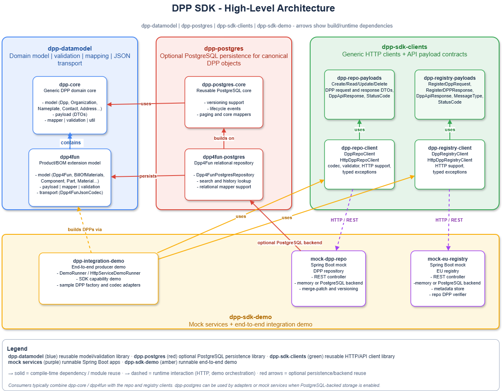

# DPP SDK



## Overview

This monorepo contains:

- The DPP data model and SDK modules implemented in Java
- Demo and mock services for DPP repository and DPP registry for end-to-end interaction
- HTTP client modules for DPP-Repository and DPP-Registry
- Demo runtime
- The implementation follows the drafted standardised API standards specified by the CEN/CENELEC JTC24 committee as of 06/2026

Use this root README as the quick entry point. For module-specific details, use the README and docs inside each subproject.

## Repository Structure

```text
.
|-- pom.xml
|-- mvnw
|-- mvnw.cmd
|-- .mvn/
|   `-- wrapper/
|-- dpp-datamodel/
|   |-- pom.xml
|   |-- mvnw
|   |-- mvnw.cmd
|   |-- dpp-core/
|   `-- dpp4fun/
|-- dpp-postgres/
|   |-- pom.xml
|   |-- dpp-postgres-core/
|   `-- dpp4fun-postgres/
|-- dpp-sdk-clients/
|   |-- pom.xml
|   |-- mvnw
|   |-- mvnw.cmd
|   |-- dpp-repo-payloads/
|   |-- dpp-repo-client/
|   |-- dpp-registry-payloads/
|   `-- dpp-registry-client/
`-- dpp-sdk-demo/
    |-- pom.xml
    |-- .env
    |-- docker-compose.yml
    |-- mvnw
    |-- mvnw.cmd
    |-- mock-dpp-repo/
    |-- mock-eu-registry/
    `-- dpp-integration-demo/
```

## Project Responsibilities

- `dpp-datamodel`: DPP domain model, validation, mapping, and JSON transport.
- `dpp-postgres`: optional PostgreSQL persistence for `Dpp4Fun`, including reusable core/version support and the Dpp4Fun-specific relational repository.
- `dpp-sdk-clients`: generic repository and registry HTTP clients plus API payload contracts.
- `dpp-sdk-demo`: mock repository, mock registry, integration demo, Docker runtime, Postman collections, and demo guides.

## Artifacts And Dependencies

Consumer-facing artifacts are built in this monorepo and can then be consumed from the local Maven repository after a local `clean install`. The demo subproject is runnable/demo code, not a reusable library dependency.

After building and installing the relevant subprojects locally, use these modules when consuming the monorepo from another project:

- `com.example.dppsdk:dpp-core:0.3.0`
- `com.example.dppsdk:dpp4fun:0.3.0`
- `dpp.client:dpp-repo-payloads:0.3.0`
- `dpp.client:dpp-repo-client:0.3.0`
- `dpp.client:dpp-registry-payloads:0.3.0`
- `dpp.client:dpp-registry-client:0.3.0`

Typical import choices:

- import `dpp-core` when you need the reusable core DPP domain model and validation types
- import `dpp4fun` when you need the furniture-specific SDK layer on top of `dpp-core`
- import only the specific `dpp-sdk-clients` modules your application needs
- do not depend on `dpp-sdk-demo` as a library; use it as runnable reference/demo code

## Optional PostgreSQL Persistence

The root-level `dpp-postgres` module is optional.

- Use it when an application wants durable relational PostgreSQL persistence for `Dpp4Fun`.
- It contains:
  - `dpp-postgres-core`
  - `dpp4fun-postgres`
- It is not required for users who only need models, validation, and JSON handling from `dpp-datamodel`.
- `mock-dpp-repo` can run with either backend:
  - `dpp.repo.backend=memory`
  - `dpp.repo.backend=postgres`
- Memory remains the default mock backend.
- As the repository is configured right now, the default startup mode is still memory mode unless you explicitly set the PostgreSQL backend property.
- You only need to run a PostgreSQL server if you choose PostgreSQL persistence. For the default memory mode, you do not need PostgreSQL running.

### Backend choice for `mock-dpp-repo`

Use the in-memory backend explicitly:

```properties
dpp.repo.backend=memory
```

Use the PostgreSQL backend explicitly:

```properties
dpp.repo.backend=postgres
spring.datasource.url=jdbc:postgresql://localhost:5432/dpp
spring.datasource.username=postgres
spring.datasource.password=postgres
```

What this means in practice:

- If you do nothing, `mock-dpp-repo` starts in memory mode.
- If you set `dpp.repo.backend=postgres`, then you must have a PostgreSQL server running and reachable with the configured datasource settings.
- The HTTP API stays the same in both modes. Only the storage backend changes.

For PostgreSQL usage examples, see [dpp-postgres/README.md](dpp-postgres/README.md).

## Entry-Point Example

The main SDK flow is:

1. build a canonical `Dpp4Fun`
2. validate it
3. serialize it when needed
4. send it through the repository client
5. deserialize and validate on the receiving side
6. optionally persist it with PostgreSQL

### Build, Validate, Serialize, And Use The Repo Client

```java
import dpp.repo.client.HttpDppRepoClient;
import dpp.repo.client.core.DppCodec;
import dpp.repo.client.core.DppValidator;
import dppsdk.core.model.DppCore;
import dppsdk.core.model.Nameplate;
import dppsdk.core.model.PassportMetadata;
import dppsdk.dpp4fun.model.Characteristics;
import dppsdk.dpp4fun.model.Dimensions;
import dppsdk.dpp4fun.model.Dpp4Fun;
import dppsdk.dpp4fun.model.ProductClassification;
import dppsdk.dpp4fun.transport.Dpp4FunJsonCodec;
import dppsdk.dpp4fun.validation.Dpp4FunValidationService;

import java.time.LocalDate;
import java.util.UUID;

// 1. Build the reusable core identity block shared by DPP types.
PassportMetadata metadata = new PassportMetadata.Builder()
        .uniqueProductIdentifier(UUID.fromString("11111111-1111-1111-1111-111111111111"))
        .addPassportUpdateDate(LocalDate.of(2026, 6, 29))
        .qrCodeOrDigitalTag("https://example.com/dpp/11111111-1111-1111-1111-111111111111")
        .build();

Nameplate nameplate = new Nameplate.Builder()
        .gtinCode("04012345678901")
        .build();

// DppCore groups the common passport metadata and nameplate fields.
DppCore coreDpp = new DppCore.Builder()
        .passportMetadata(metadata)
        .nameplate(nameplate)
        .build();

// 2. Add the Dpp4Fun-specific classification and product characteristics.
ProductClassification classification = new ProductClassification.Builder()
        .sector("Furniture")
        .group("Home furniture")
        .category("Beds")
        .addTag("demo")
        .build();

Characteristics characteristics = new Characteristics.Builder()
        .productName("Cir4Fun Platform Bed")
        .brand("Cir4Fun")
        .productType("Bed")
        .dimensions(new Dimensions.Builder()
                .width(90.0)
                .height(80.0)
                .depth(120.0)
                .unit("cm")
                .build())
        .weight(24.5)
        .addFeature("repairable")
        .build();

// 3. Build the canonical immutable Dpp4Fun aggregate.
Dpp4Fun dpp = new Dpp4Fun.Builder()
        .coreDpp(coreDpp)
        .classification(classification)
        .characteristics(characteristics)
        .build();

// 4. Run semantic validation before transport or persistence.
Dpp4FunValidationService validator = new Dpp4FunValidationService();
validator.validate(dpp);

// 5. Serialize to the standard JSON transport shape and read it back again.
Dpp4FunJsonCodec codec = new Dpp4FunJsonCodec();
String json = codec.toJson(dpp);
Dpp4Fun parsed = codec.fromJson(json);
validator.validate(parsed);

// 6. Adapt the SDK codec/validator to the generic HTTP repo client interfaces.
DppCodec<Dpp4Fun> clientCodec = new DppCodec<>() {
    @Override
    public String toJson(Dpp4Fun value) {
        return codec.toJson(value);
    }

    @Override
    public Dpp4Fun fromJson(String value) {
        return codec.fromJson(value);
    }
};

DppValidator<Dpp4Fun> clientValidator = validator::validate;

// 7. Use the high-level repository client against a running repo service.
HttpDppRepoClient<Dpp4Fun> repoClient = new HttpDppRepoClient<>(
        "http://localhost:8080",
        clientCodec,
        clientValidator
);

// 8. Store and read back the full DPP through the standard repo API.
repoClient.createDpp(dpp);
Dpp4Fun fromRepo = repoClient.readDppById(dpp.getDppId());
```

How to read this example:

- `dpp-datamodel` gives you the builders, the validation service, and the JSON codec.
- `dpp-sdk-clients` gives you the high-level HTTP client.
- The client stays generic, so you supply a codec and validator for your concrete DPP type.
- The same `Dpp4Fun` object can then be sent to the mock repo or any compatible repo implementation.

### Deserialize, Validate, And Persist With PostgreSQL

```java
import dppsdk.dpp4fun.transport.Dpp4FunJsonCodec;
import dppsdk.dpp4fun.validation.Dpp4FunValidationService;
import dppsdk.postgres.core.PostgresDppOperationContext;
import dppsdk.postgres.dpp4fun.Dpp4FunPostgresRepository;
import org.postgresql.ds.PGSimpleDataSource;

Dpp4FunJsonCodec codec = new Dpp4FunJsonCodec();
Dpp4FunValidationService validator = new Dpp4FunValidationService();

Dpp4Fun parsed = codec.fromJson(json);
validator.validate(parsed);

PGSimpleDataSource dataSource = new PGSimpleDataSource();
dataSource.setURL("jdbc:postgresql://localhost:5432/dpp");
dataSource.setUser("postgres");
dataSource.setPassword("postgres");

Dpp4FunPostgresRepository repository = new Dpp4FunPostgresRepository(dataSource);
repository.create(parsed, new PostgresDppOperationContext("create-demo", java.time.Instant.now()));
```

This PostgreSQL persistence path is optional. If you are only using the mock repo in its default memory mode, you do not need a PostgreSQL server.

Local install flow before consumption:

- run `.\mvnw.cmd -f dpp-datamodel/pom.xml clean install` to install `dpp-core` and `dpp4fun` locally
- run `.\mvnw.cmd -f dpp-sdk-clients/pom.xml clean install` to install the client modules locally
- then add the required dependencies in the consuming project

## Prerequisites

- JDK 17 or newer on `PATH`, or set `JAVA_HOME`
- Recommended JDK: Java 17.
- The project targets Java 17. Newer JDKs may work, but Java 17 is the supported baseline for development and validation.
- Docker Desktop or another Docker engine for Docker workflows
- No local Maven install is required when you use the root Maven wrapper
- The Maven wrapper downloads Maven automatically on first use

Current wrapper configuration:

- Maven Wrapper `3.3.4`
- Maven distribution `3.9.11`

## Quick Start: Build and Test Everything

Run from the repository root.

Windows:

```powershell
.\mvnw.cmd --version      # Show the Maven wrapper and Java runtime in use
.\mvnw.cmd clean test     # Rebuild and run the full reactor test suite
.\mvnw.cmd clean package  # Build all modules and create the packaged artifacts
.\mvnw.cmd clean verify   # Run the full verification lifecycle across the reactor
.\mvnw.cmd -pl dpp-postgres/dpp4fun-postgres,dpp-sdk-demo/mock-dpp-repo -am test  # Focused PostgreSQL + mock backend validation
```

Linux/macOS:

```bash
./mvnw --version      # Show the Maven wrapper and Java runtime in use
./mvnw clean test     # Rebuild and run the full reactor test suite
./mvnw clean package  # Build all modules and create the packaged artifacts
./mvnw clean verify   # Run the full verification lifecycle across the reactor
./mvnw -pl dpp-postgres/dpp4fun-postgres,dpp-sdk-demo/mock-dpp-repo -am test  # Focused PostgreSQL + mock backend validation
```

## Build Individual Projects

The safest root-level commands for individual subprojects are `-f` builds against each subproject aggregator.

Windows:

```powershell
.\mvnw.cmd -f dpp-datamodel/pom.xml clean install   # Build and install the SDK/data-model artifacts locally
.\mvnw.cmd -f dpp-sdk-clients/pom.xml clean install # Build and install the generic client artifacts locally
.\mvnw.cmd -f dpp-sdk-demo/pom.xml clean package    # Build the demo modules and create the runnable jars
```

Linux/macOS:

```bash
./mvnw -f dpp-datamodel/pom.xml clean install   # Build and install the SDK/data-model artifacts locally
./mvnw -f dpp-sdk-clients/pom.xml clean install # Build and install the generic client artifacts locally
./mvnw -f dpp-sdk-demo/pom.xml clean package    # Build the demo modules and create the runnable jars
```

Reactor build order is:

1. `dpp-datamodel`
2. `dpp-postgres`
3. `dpp-sdk-clients`
4. `dpp-sdk-demo`

Subproject wrappers still exist, but the root wrapper is now the canonical entry point for monorepo builds.

## Run Demo Services as JARs

Package the repo first with the root wrapper or `-f dpp-sdk-demo/pom.xml clean package`.

Windows:

```powershell
java -jar dpp-sdk-demo\mock-eu-registry\target\mock-eu-registry-1.0.0-SNAPSHOT-exec.jar --debug=false     # Start the mock registry service
java -jar dpp-sdk-demo\mock-dpp-repo\target\mock-dpp-repo-1.0.0-SNAPSHOT-exec.jar --debug=false           # Start the mock repo service
java -jar dpp-sdk-demo\dpp-integration-demo\target\dpp-integration-demo-1.0.0-SNAPSHOT.jar http --debug=false # Run the HTTP integration demo flow
```

Linux/macOS:

```bash
java -jar dpp-sdk-demo/mock-eu-registry/target/mock-eu-registry-1.0.0-SNAPSHOT-exec.jar --debug=false     # Start the mock registry service
java -jar dpp-sdk-demo/mock-dpp-repo/target/mock-dpp-repo-1.0.0-SNAPSHOT-exec.jar --debug=false           # Start the mock repo service
java -jar dpp-sdk-demo/dpp-integration-demo/target/dpp-integration-demo-1.0.0-SNAPSHOT.jar http --debug=false # Run the HTTP integration demo flow
```

Additional integration demo modes:

- default run: no mode argument
- `sdk`
- `http`
- `all`

Note:

- The commands above work from the repo root with the default ports `8080` and `8081`.
- If you want `dpp-sdk-demo/.env` to override ports for direct JAR runs, start those processes from inside `dpp-sdk-demo`.
- With the current checked-in configuration, `mock-dpp-repo` starts in memory mode unless you add `DPP_REPO_BACKEND=postgres` and datasource settings.

## Run with Docker

The committed Docker config lives under `dpp-sdk-demo` and uses `dpp-sdk-demo/.env` for the local ports.

This workflow requires source code, Java, the root Maven wrapper, and Docker.

Windows:

```powershell
.\mvnw.cmd -f dpp-sdk-demo/pom.xml clean package                                           # Build the demo jars used by the Docker images
docker compose -f dpp-sdk-demo/docker-compose.yml --env-file dpp-sdk-demo/.env up --build  # Build the local images and start the demo services
```

Linux/macOS:

```bash
./mvnw -f dpp-sdk-demo/pom.xml clean package                                           # Build the demo jars used by the Docker images
DOCKER_DEFAULT_PLATFORM=linux/amd64 docker compose -f dpp-sdk-demo/docker-compose.build.yml --env-file dpp-sdk-demo/.env up --build  # Build the local images and start the demo services
```

### Docker networking note

- From the host machine, use `localhost`.
- From one container to another, use the service name `mock-dpp-repo`.
- The registry container must reach the repo at `http://mock-dpp-repo:8080`, not `http://localhost:8080`.

## Useful URLs

- Repo service: `http://localhost:8080`
- Registry service: `http://localhost:8081`
- Repo health: `http://localhost:8080/health`
- Registry health: `http://localhost:8081/health`
- Repo Swagger UI: `http://localhost:8080/swagger-ui.html`
- Repo OpenAPI JSON: `http://localhost:8080/v3/api-docs`
- Registry Swagger UI: `http://localhost:8081/swagger-ui.html`
- Registry OpenAPI JSON: `http://localhost:8081/v3/api-docs`

Swagger UI is the easiest interactive entry point once the mock services are running:

- open the repo Swagger UI to explore create/read/update/delete, fine-granular, and lifecycle-event endpoints
- open the registry Swagger UI to explore registration and registry-metadata endpoints
- use the OpenAPI JSON endpoints when you want the machine-readable API description for tooling or import

## Documentation Map

- `CHANGELOG.md`: release-oriented summary of notable repository changes.
- `LICENSE`: project license.
- `dpp-datamodel/README.md`: entry point for the SDK/datamodel modules.
- `dpp-datamodel/DPP_SDK_OVERVIEW.md`: high-level SDK architecture and module intent.
- `dpp-datamodel/SDK_USAGE.md`: practical SDK usage patterns.
- `dpp-datamodel/MODEL_GUIDE.md`: the canonical `DppCore` and `Dpp4Fun` model structure.
- `dpp-datamodel/VALIDATION_GUIDE.md`: how validation is structured and used.
- `dpp-datamodel/VALIDATION_RULES.md`: detailed validation rules.
- `dpp-datamodel/LOCAL_CONSUMPTION.md`: how to consume locally built datamodel artifacts.
- `dpp-postgres/README.md`: PostgreSQL module structure, repository usage, and build/test notes.
- `dpp-sdk-clients/README.md`: entry point for the generic HTTP client modules.
- `dpp-sdk-clients/docs/pren-18222-api-alignment.md`: notes on API alignment with the draft standard.
- `dpp-sdk-clients/dpp-repo-payloads/README.md`: shared repository payload DTOs.
- `dpp-sdk-clients/dpp-repo-client/README.md`: repository HTTP client usage.
- `dpp-sdk-clients/dpp-registry-payloads/README.md`: shared registry payload DTOs.
- `dpp-sdk-clients/dpp-registry-client/README.md`: registry HTTP client usage.
- `dpp-sdk-demo/README.md`: how to build and run the mock services and demo runtime.
- `dpp-sdk-demo/DEMO_GUIDE.md`: presenter-oriented walkthrough of the demo flow.

## Current Limitations

- This repository is a pre-release reference/demo repository.
- `mock-dpp-repo` and `mock-eu-registry` are mock/demo services, not production services.
- Real persistence, security, and real EU registry integration are not implemented here.

## Detailed Docs

For details, use the README and docs inside each subproject and module. This root README is only the quick entry point.
