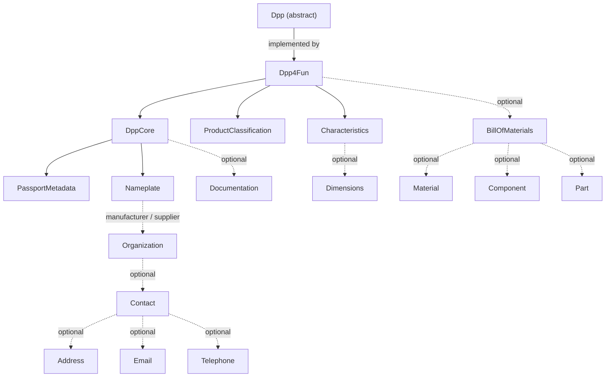

# Model and Validation Guide

This is the detailed reference for the immutable domain model, construction checks, and semantic validation in `dpp-core` and `dpp4fun`. Start with the consumer-oriented [README.md](README.md) for dependencies and end-to-end use. Builders throw `IllegalArgumentException` for their local checks; validation is fail-fast and throws `ValidationException` for the first semantic failure.

## How to use this guide

Read the object graph first, then find a type below. “Builder checks” happen at `build()` time. “Validator rules” happen only when the relevant validator or validation service is called; a type described as optional returns successfully when its individual validator receives `null`.

- [Core model](#core-model)
- [Dpp4Fun model](#dpp4fun-model)
- [Validation services](#validation-services)
- [Immutable editing](#immutable-editing)

## Visual model graph



The labelled `Dpp` edge is the implementation relationship. Other solid arrows are required aggregate relationships; dashed arrows are optional nested values or collections. Read the text graph below for the exact structure and then use the per-type sections for fields and validation rules.

## Object graph

```text
Dpp (abstract)
`-- Dpp4Fun
    +-- DppCore
    |   +-- PassportMetadata
    |   +-- Nameplate
    |   |   +-- Organization (manufacturer and/or supplier)
    |   |       `-- Contact
    |   |           +-- Address
    |   |           +-- Email
    |   |           `-- Telephone
    |   `-- Documentation (optional)
    +-- ProductClassification
    +-- Characteristics
    |   `-- Dimensions (optional)
    `-- BillOfMaterials (optional)
        +-- Material
        +-- Component
        `-- Part
```

`Dpp4Fun` is the concrete `Dpp` implementation in this source tree. It returns the passport type string `Dpp4Fun Furniture`.

## Core model

### `Dpp`

- Abstract aggregate base with `getCoreDpp()` and `getPassportType()`.
- Convenience accessors delegate to the core: passport metadata, nameplate, documentation, UUID, update dates, QR/digital tag, external documentation link, GTIN, manufacturer, supplier, and instruction links.
- `getDppId()` returns the UUID as a string and throws `IllegalStateException` when the UUID is null. `getProductId()` returns the GTIN and throws `IllegalStateException` when it is null.

### `DppCore`

- Fields: required `passportMetadata`, required `nameplate`, optional `documentation`.
- Builder checks: metadata and nameplate are non-null.
- `DppCoreValidator`: the core and both required fields must be non-null; validates `PassportMetadata`, `Nameplate`, and optional `Documentation`.

### `PassportMetadata`

- Fields: required `uniqueProductIdentifier` (`UUID`), required non-empty `passportUpdateDates` (`List<LocalDate>`), optional `qrCodeOrDigitalTag`, optional `externalDocumentationLink`.
- Builder checks: UUID and at least one date are required; `addPassportUpdateDate` rejects null; supplied strings cannot be blank. Dates are defensively copied.
- `PassportMetadataValidator`: rejects null metadata, null UUID, empty dates, null date entries, and dates after `LocalDate.now()`; supplied strings cannot be blank.

### `Nameplate`

- Fields: required `gtinCode`; optional `internalArticleNumber`, `batchNumber`, `customsTariffNumber`, `uriOfTheProduct`, `manufacturer`, and `supplier`.
- Builder checks: GTIN is required; supplied identifier strings cannot be blank.
- `NameplateValidator`: GTIN is required; supplied identifier strings cannot be blank; at least a manufacturer or supplier is required. Each present organization is validated. A manufacturer must have role `MANUFACTURER`; a supplier must have role `SUPPLIER` (a null role fails in either slot).

### `Organization`

- Fields: required `name`; optional `gln`, `productDescription`, `productDesignation`, `productFamily`, `productRoot`, `productOrderSuffix`, `uri`, `contact`, and `role` (`OrganizationRole`).
- Builder checks: name is required; every supplied string field above cannot be blank.
- `OrganizationValidator`: organization and name are required; supplied `uri` cannot be blank; validates a present contact. `role` is optional here and is constrained by `NameplateValidator` when used as manufacturer or supplier.

### `OrganizationRole`

- Enum values: `MANUFACTURER`, `SUPPLIER`, and `DISTRIBUTOR`.
- It has no builder or standalone validator. `NameplateValidator` permits only `MANUFACTURER` in the manufacturer slot and `SUPPLIER` in the supplier slot.

### `Contact`

- Fields: required `organization`; optional `address`, `email`, and `telephone`.
- Builder checks: organization is required and cannot be blank.
- `ContactValidator`: optional as a nested value; when present, organization is required and at least one of address, email, or telephone must be present. Validates each present channel.

### `Address`

- Fields: required `country` and `town`; optional `zipCode`, `region`, and `street`.
- Builder checks and `AddressValidator`: country and town are required; each supplied optional string cannot be blank. The individual validator treats a null address as optional.

### `Email`

- Fields: required `emailAddress`; optional `typeOfEmail`.
- Builder checks: email address is required; a supplied type cannot be blank.
- `EmailValidator`: optional as a nested value; when present, address is required, must contain `@`, and supplied type cannot be blank.

### `Telephone`

- Fields: required `telephoneNumber`; optional `typeOfTelephone`.
- Builder checks and `TelephoneValidator`: number is required and a supplied type cannot be blank. The individual validator treats a null telephone as optional.

### `Documentation`

- Fields: optional `digitalInstructionsLink`, optional `safetyInstructionsLink`, `downloadable` (boolean), optional `availableForYears` (`Integer`), and `paperCopyAvailableOnRequest` (boolean).
- Builder checks: supplied links cannot be blank; `availableForYears` cannot be negative.
- `DocumentationValidator`: optional as a nested value; supplied links cannot be blank. If `downloadable` is true, at least one link is required. A supplied `availableForYears` must be non-negative and also requires at least one link.

## Dpp4Fun model

### `Dpp4Fun`

- Fields: required `coreDpp`, required `classification`, required `characteristics`, optional `billOfMaterials`.
- Builder checks: all three required fields are non-null.
- `Dpp4FunValidator`: validates the core, classification, characteristics, and optional bill of materials. When both category and product type have text, either one must contain the other after trimming and lowercasing. A non-blank external documentation link requires a documentation object.

### `ProductClassification`

- Fields: required `sector` and `category`; optional `group`, optional `subCategory`, and `tags` list.
- Builder checks: sector and category are required; supplied group and subcategory cannot be blank. `addTag` appends to the list and `removeTag` removes a value.
- `ProductClassificationValidator`: sector and category are required; supplied group/subcategory cannot be blank; non-blank subcategory requires a non-blank category and non-blank group requires a non-blank sector. Tags, when non-empty, cannot contain null, blank, or duplicate values after trim/lowercase comparison.

### `Characteristics`

- Fields: required `productName`; optional `description`, `brand`, `productType`, `dimensions`, `weight`, `color`; and `features` list.
- Builder checks: product name is required; supplied description, brand, product type, and color cannot be blank; weight cannot be negative. `addFeature` and `removeFeature` edit the builder list.
- `CharacteristicsValidator`: product name is required; supplied weight must be non-negative; validates present dimensions. Features, when non-empty, cannot contain null, blank, or duplicate values after trim/lowercase comparison.

### `Dimensions`

- Fields: `width`, `height`, `depth` (`Double`), and optional `unit`.
- Builder checks: all three measurements are required and non-negative; a supplied unit cannot be blank.
- `DimensionsValidator`: optional as a nested value; checks non-negative measurements, requires at least one measurement, and requires a non-blank unit when a measurement is present. The builder’s stricter checks mean normally constructed instances have all three measurements, while the validator also protects values obtained through mapping.

### `BillOfMaterials`

- Fields: `materials`, `components`, and `parts` lists. A builder starts with empty lists; `add*`/`remove*` methods edit each list.
- Builder checks: none; lists are defensively copied.
- `BillOfMaterialsValidator`: optional as a nested value. Each list cannot contain null entries; each item is validated; duplicates within a list are rejected using a trimmed, lowercased `name|reference` key.

### `Material`

- Fields: required `name`, `mandatory` (boolean), required `portion` (`double`), optional `reference`.
- Builder checks: name is required; portion cannot be negative; supplied reference cannot be blank.
- `MaterialValidator`: name is required, portion must be non-negative, supplied reference cannot be blank, and a mandatory material must have a portion greater than zero.

### `Component`

- Fields: required `name`, optional `reference`.
- Builder checks and `ComponentValidator`: name is required; supplied reference cannot be blank. The individual validator treats a null component as optional.

### `Part`

- Fields: required `name`, `mandatory` (boolean), optional `reference`.
- Builder checks and `PartValidator`: name is required; supplied reference cannot be blank. The individual validator treats a null part as optional; it does not impose an additional rule for `mandatory`.

## Validation services

`ValidationService` registers validators for `Email`, `Telephone`, `Address`, `Contact`, `DppCore`, `PassportMetadata`, `Nameplate`, `Organization`, and `Documentation`. It rejects null values and values with no registered compatible validator; callers can add validators with `register`.

`Dpp4FunValidationService` starts with that core service and registers `Dimensions`, `Material`, `Component`, `Part`, `ProductClassification`, `Characteristics`, `BillOfMaterials`, `Dpp4Fun`, and `Dpp`. For a `Dpp`, it validates only the concrete `Dpp4Fun` subtype; another subtype fails.

## Immutable editing

Every concrete model type in this guide provides `toBuilder()`. Use it to create a changed copy; domain objects do not expose setters.

```java
Dpp4Fun updated = dpp.toBuilder()
        .characteristics(dpp.getCharacteristics().toBuilder()
                .productName("Updated Name")
                .build())
        .build();
```

For the consumer workflow, mapping, JSON transport, and identifier helpers, return to [README.md](README.md).
