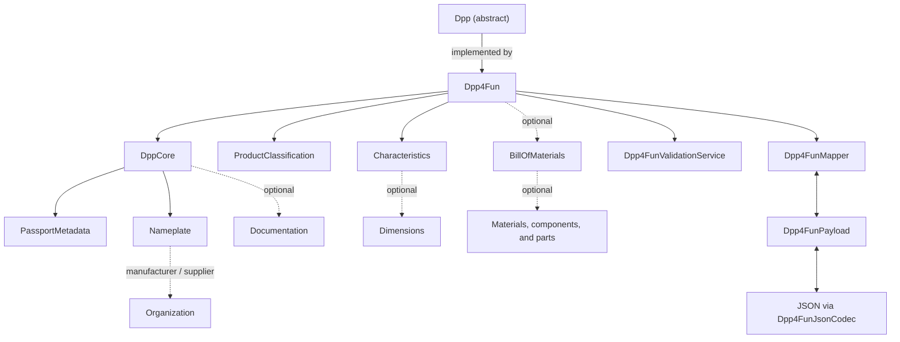

# DPP Data Model

`dpp-datamodel` is the Java SDK area for immutable Digital Product Passport (DPP) domain objects. It provides builders, validation, payload mapping, and JSON transport for the furniture-specific `Dpp4Fun` model. It does not provide HTTP clients, runtime services, or persistence.

## Architecture at a glance



The builders create immutable domain objects. Validation, payload mapping, and
JSON transport are separate responsibilities: `Dpp4FunValidationService`
checks semantic rules, `Dpp4FunMapper` converts between domain and payload
objects, and `Dpp4FunJsonCodec` handles JSON. The result is consumed by the
HTTP clients or persistence modules; those modules are outside this datamodel
boundary.

## Choose a module

| Need | Dependency |
| --- | --- |
| Reusable DPP identity, metadata, nameplate, documentation, validation, payload DTOs, and core mappers | `dpp.datamodel:dpp-core:0.5.0` |
| A furniture DPP aggregate (`Dpp4Fun`), furniture validation, furniture payload mapping, or JSON transport | `dpp.datamodel:dpp4fun:0.5.0` |

Choose the dependency that matches your use case. Applications using `dpp4fun` do not need to declare `dpp-core` separately because it is included transitively.

### Reusable core only

```xml
<dependency>
    <groupId>dpp.datamodel</groupId>
    <artifactId>dpp-core</artifactId>
    <version>0.5.0</version>
</dependency>
```

### Furniture-specific DPP

```xml
<dependency>
    <groupId>dpp.datamodel</groupId>
    <artifactId>dpp4fun</artifactId>
    <version>0.5.0</version>
</dependency>
```

## Practical usage

### Build the reusable core

```java
import dppsdk.core.model.DppCore;
import dppsdk.core.model.Nameplate;
import dppsdk.core.model.Organization;
import dppsdk.core.model.OrganizationRole;
import dppsdk.core.model.PassportMetadata;

import java.time.LocalDate;
import java.util.UUID;

PassportMetadata metadata = new PassportMetadata.Builder()
        .uniqueProductIdentifier(UUID.fromString("11111111-1111-1111-1111-111111111111"))
        .addPassportUpdateDate(LocalDate.of(2026, 6, 29))
        .qrCodeOrDigitalTag("https://example.com/dpp/11111111-1111-1111-1111-111111111111")
        .build();

Organization manufacturer = new Organization.Builder()
        .name("Cir4Fun Furniture GmbH")
        .role(OrganizationRole.MANUFACTURER)
        .build();

Nameplate nameplate = new Nameplate.Builder()
        .gtinCode("04012345678901")
        .manufacturer(manufacturer)
        .build();

DppCore core = new DppCore.Builder()
        .passportMetadata(metadata)
        .nameplate(nameplate)
        .build();
```

### Build a full `Dpp4Fun`

```java
import dppsdk.dpp4fun.model.Characteristics;
import dppsdk.dpp4fun.model.Dimensions;
import dppsdk.dpp4fun.model.Dpp4Fun;
import dppsdk.dpp4fun.model.ProductClassification;

ProductClassification classification = new ProductClassification.Builder()
        .sector("Furniture")
        .group("Home furniture")
        .category("Beds")
        .addTag("demo")
        .build();

Characteristics characteristics = new Characteristics.Builder()
        .productName("Cir4Fun Platform Bed")
        .brand("Cir4Fun")
        .productType("Bed")
        .dimensions(new Dimensions.Builder()
                .width(90.0)
                .height(80.0)
                .depth(120.0)
                .unit("cm")
                .build())
        .weight(24.5)
        .addFeature("repairable")
        .build();

Dpp4Fun dpp = new Dpp4Fun.Builder()
        .coreDpp(core)
        .classification(classification)
        .characteristics(characteristics)
        .build();
```

### Validate

Use `ValidationService` for reusable core model types. Use `Dpp4FunValidationService` for the complete `Dpp4Fun` aggregate and its furniture-specific model types. Validation is fail-fast and throws `dppsdk.core.validation.ValidationException` for semantic errors.

```java
import dppsdk.core.validation.ValidationService;
import dppsdk.dpp4fun.validation.Dpp4FunValidationService;

new ValidationService().validate(core);
new Dpp4FunValidationService().validate(dpp);
```

### Map domain objects and payload DTOs

Mappers return `null` for a `null` input. During payload-to-domain conversion, structurally invalid payload data is reported as a `MappingException`, including cases where a domain builder rejects the supplied values.

```java
import dppsdk.core.mapper.DppCoreMapper;
import dppsdk.core.payload.DppCorePayload;
import dppsdk.dpp4fun.mapper.Dpp4FunMapper;
import dppsdk.dpp4fun.payload.Dpp4FunPayload;

DppCoreMapper coreMapper = new DppCoreMapper();
DppCorePayload corePayload = coreMapper.toPayload(core);
DppCore mappedCore = coreMapper.toDomain(corePayload);

Dpp4FunMapper dppMapper = new Dpp4FunMapper();
Dpp4FunPayload payload = dppMapper.toPayload(dpp);
Dpp4Fun mappedDpp = dppMapper.toDomain(payload);
```

### Serialize and deserialize `Dpp4Fun` JSON

`Dpp4FunJsonCodec` maps through `Dpp4FunPayload`. Outbound JSON places `passportMetadata`, `nameplate`, and `documentation` at the top level instead of under `coreDpp`. Inbound JSON accepts either that flat transport shape or a nested `coreDpp` object. `fromJson` maps only; `fromJsonAndValidate` maps and then validates.

```java
import dppsdk.dpp4fun.transport.Dpp4FunJsonCodec;

Dpp4FunJsonCodec codec = new Dpp4FunJsonCodec();
String json = codec.toJson(dpp);
Dpp4Fun parsed = codec.fromJson(json);
Dpp4Fun parsedAndValidated = codec.fromJsonAndValidate(json);
```

### Make an immutable edit

Models have no setters. `toBuilder()` copies the current value into a builder; collections expose add/remove operations on their builders.

The following example continues from the `dpp` object constructed above.

```java
// Copy the immutable object, change one nested value, and build a new instance.
Dpp4Fun updated = dpp.toBuilder()
        .characteristics(dpp.getCharacteristics().toBuilder()
                .productName("Cir4Fun Platform Bed - Updated")
                .build())
        .build();
```

### Extract identifiers

`DppIdentifiers` accepts any `Dpp` aggregate. It rejects a null aggregate; the delegated convenience accessors reject a missing unique product identifier or GTIN.

```java
import dppsdk.core.util.DppIdentifiers;

String dppId = DppIdentifiers.dppId(dpp);
String productId = DppIdentifiers.productId(dpp);
```

For every field, builder constraint, and semantic validation rule, see [MODEL_GUIDE.md](MODEL_GUIDE.md).

## Build and install for contributors

Requires JDK 17. The Maven wrapper is at the repository root. The commands below keep the working directory at the repository root and select the datamodel reactor with `-f`.

Required working directory: repository root.

### Run all datamodel tests

PowerShell:

```powershell
.\mvnw.cmd -f .\dpp-datamodel\pom.xml test
```

Linux/macOS Bash:

```bash
./mvnw -f ./dpp-datamodel/pom.xml test
```

### Install the artifacts locally

PowerShell:

```powershell
.\mvnw.cmd -f .\dpp-datamodel\pom.xml clean install
```

Linux/macOS Bash:

```bash
./mvnw -f ./dpp-datamodel/pom.xml clean install
```

### Run focused module tests

`dpp-core` from the repository root — PowerShell:

```powershell
.\mvnw.cmd -f .\dpp-datamodel\pom.xml -pl dpp-core -am test
```

`dpp-core` from the repository root — Linux/macOS Bash:

```bash
./mvnw -f ./dpp-datamodel/pom.xml -pl dpp-core -am test
```

`dpp4fun` from the repository root — PowerShell:

```powershell
.\mvnw.cmd -f .\dpp-datamodel\pom.xml -pl dpp4fun -am test
```

`dpp4fun` from the repository root — Linux/macOS Bash:

```bash
./mvnw -f ./dpp-datamodel/pom.xml -pl dpp4fun -am test
```

## Module boundaries

This module provides:

- domain models and builders
- semantic validation
- payload mapping
- `Dpp4Fun` JSON transport

It does not provide:

- HTTP clients or endpoints
- mock services or runtime orchestration
- PostgreSQL persistence
- production compliance or certification guarantees

Related modules:

- [DPP SDK clients](../dpp-sdk-clients/README.md) — HTTP clients and payload contracts
- [DPP PostgreSQL](../dpp-postgres/README.md) — relational persistence
- [DPP SDK demo](../dpp-sdk-demo/README.md) — runnable services and Docker

## Aggregator POM

The module aggregator is `dpp.datamodel:dpp-datamodel:0.5.0`. It has
`pom` packaging and is not a runtime library dependency.
