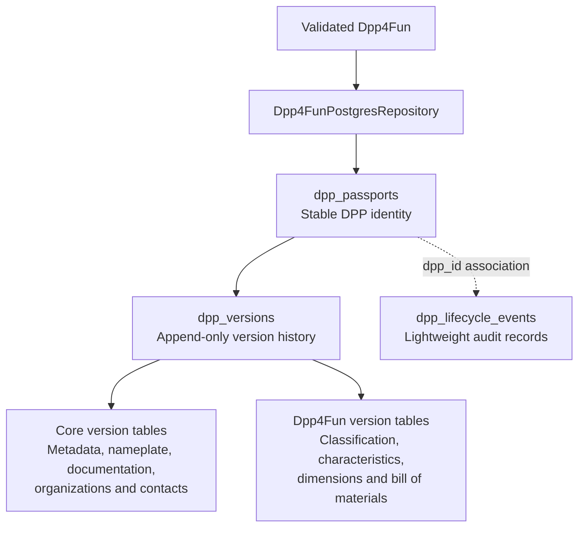

# DPP PostgreSQL

## Purpose

`dpp-postgres` is the optional PostgreSQL-specific persistence area for DPP aggregates. It stores full, already validated domain objects as a stable passport identity plus versioned relational data. It does not own semantic validation, JSON transport, HTTP clients, Docker/runtime setup, or mock services.

## Architecture at a glance



Persistence receives a validated aggregate, keeps one stable passport
identity, and stores version-bound relational data. Lifecycle events are
separate audit records associated by `dpp_id`; they are not the canonical
DPP state. The versioned relational state is authoritative. Lifecycle events
describe operations but cannot be replayed to reconstruct the complete DPP.

The aggregate is decomposed into normalized relational tables. "Full DPP"
means that the complete aggregate state is retained, not that it is stored as
one serialized object or JSON document.

## When to use it

- Use `dpp-postgres-core` when implementing PostgreSQL persistence support shared across DPP aggregate types: core relational mapping, stable identity/version handling, lifecycle-event storage, and cursor page records.
- Use `dpp4fun-postgres` when persisting or querying the complete furniture-specific `Dpp4Fun` aggregate. This is the consumer-facing repository module and it brings `dpp-postgres-core` transitively.
- Do not use either module when an application only builds, validates, maps, serializes, transports, or consumes DPP objects without PostgreSQL persistence.

Semantic validation remains in `dpp-datamodel`. `Dpp4FunPostgresRepository` expects a complete, already validated `Dpp4Fun`; it does not validate, parse JSON, apply merge patches, or evaluate element paths.

## Module map

| Module | Coordinates | Responsibility |
| --- | --- | --- |
| `dpp-postgres-core` | `dpp.postgres:dpp-postgres-core:0.4.0` | Reusable PostgreSQL schema/bootstrap support, core mapping, passport/version support, lifecycle events, and pages |
| `dpp4fun-postgres` | `dpp.postgres:dpp4fun-postgres:0.4.0` | `Dpp4Fun` mapping, `Dpp4FunPostgresRepository`, history, batch lookup, and search projections |

## Maven dependencies

Use `dpp-postgres-core` only when an application needs those reusable PostgreSQL primitives directly:

```xml
<dependency>
    <groupId>dpp.postgres</groupId>
    <artifactId>dpp-postgres-core</artifactId>
    <version>0.4.0</version>
</dependency>
```

Use `dpp4fun-postgres` for the complete furniture repository; it already depends on `dpp-postgres-core`, `dpp-core`, and `dpp4fun`:

```xml
<dependency>
    <groupId>dpp.postgres</groupId>
    <artifactId>dpp4fun-postgres</artifactId>
    <version>0.4.0</version>
</dependency>
```

## Minimal repository setup

`Dpp4FunPostgresRepository` accepts a `javax.sql.DataSource` and initializes the core and Dpp4Fun schemas in its constructor. The following uses PostgreSQL’s `PGSimpleDataSource`; connection details are application configuration.

```java
import dppsdk.postgres.dpp4fun.Dpp4FunPostgresRepository;
import org.postgresql.ds.PGSimpleDataSource;

PGSimpleDataSource dataSource = new PGSimpleDataSource();
dataSource.setURL("jdbc:postgresql://localhost:5432/dpp");
dataSource.setUser("postgres");
dataSource.setPassword("postgres");

Dpp4FunPostgresRepository repository = new Dpp4FunPostgresRepository(dataSource);
```

Validate the complete object with the datamodel before persistence:

```java
import dppsdk.dpp4fun.validation.Dpp4FunValidationService;
import dppsdk.postgres.core.PostgresDppOperationContext;

new Dpp4FunValidationService().validate(dpp);
repository.create(dpp, PostgresDppOperationContext.now());
```

## Create, read, version, delete, and search

### Create and read

`create` creates a stable passport identity and active version 1. `dppId`, `productId`, and passport type are read from the aggregate.

```java
import java.time.Instant;
import java.util.Optional;
import dppsdk.dpp4fun.model.Dpp4Fun;

Instant createdAt = Instant.parse("2026-06-29T10:00:00Z");
repository.create(
        dpp,
        new PostgresDppOperationContext("create-demo", createdAt)
);

Optional<Dpp4Fun> currentByDppId = repository.findCurrentByDppId(dpp.getDppId());
Optional<Dpp4Fun> currentByProductId = repository.findCurrentByProductId(dpp.getProductId());
Optional<Long> versionNo = repository.findCurrentVersionNoByDppId(dpp.getDppId());
boolean active = repository.existsActiveByDppId(dpp.getDppId());
```

### Append a version and read history

`appendVersion` uses optimistic concurrency: `expectedCurrentVersion` must equal the active version number or it throws `PostgresDppVersionConflictException`. The passport’s `productId` is immutable. The current version becomes `SUPERSEDED`, and a new `ACTIVE` version is stored.

```java
import dppsdk.postgres.dpp4fun.Dpp4FunVersionSummary;
import dppsdk.dpp4fun.model.Dpp4Fun;

Dpp4Fun updated = dpp.toBuilder()
        .characteristics(dpp.getCharacteristics().toBuilder()
                .productName("Cir4Fun Platform Bed - Updated")
                .build())
        .build();

Instant updatedAt = Instant.parse("2026-06-29T12:00:00Z");
repository.appendVersion(
        updated,
        1L, // Expected current version for optimistic concurrency.
        new PostgresDppOperationContext("update-demo", updatedAt)
);

Optional<Dpp4Fun> versionOne = repository.findByDppIdAt(
        dpp.getDppId(), Instant.parse("2026-06-29T11:00:00Z")
);
Optional<Dpp4Fun> versionTwo = repository.findByDppIdAt(
        dpp.getDppId(), Instant.parse("2026-06-29T13:00:00Z")
);
java.util.List<Dpp4FunVersionSummary> history = repository.findHistoryByDppId(dpp.getDppId());
```

### Soft delete

`softDelete` also uses the expected current version. It marks the active version `DELETED`, sets the passport’s `deleted_at`, and appends a `DPP_DELETED` lifecycle event. The stable identity and prior versions remain available through history/time-based lookup; current lookups and active searches no longer return it.

```java
repository.softDelete(dpp.getDppId(), 2L, Instant.parse("2026-06-29T14:00:00Z"));
boolean stillKnown = repository.existsAnyByDppId(dpp.getDppId());
```

### Search and batch lookup

`search` returns lightweight `Dpp4FunSearchResult` projections from active versions, ordered by DPP ID. Its exact-match filters are `sector`, `category`, `brand`, `productType`, `materialName`, `componentName`, and `partName`. `limit` defaults to 50 and `offset` to 0; a provided limit must be positive and offset non-negative.

```java
import dppsdk.postgres.core.DppPage;
import dppsdk.postgres.core.DppPageRequest;
import dppsdk.postgres.dpp4fun.Dpp4FunSearchCriteria;
import dppsdk.postgres.dpp4fun.Dpp4FunSearchResult;

java.util.List<Dpp4FunSearchResult> results = repository.search(
        new Dpp4FunSearchCriteria(
                "Furniture", "Beds", null, null, null, null, null, 10, 0
        )
);

DppPage<String> page = repository.findActiveDppIdsByProductIds(
        java.util.List.of(dpp.getProductId()),
        new DppPageRequest(null, 50)
);
```

Fine-granular JSONPath or element-path evaluation is not implemented in persistence. `DATA_ELEMENT_UPDATED` is an audit event type only; callers may record it with `recordLifecycleEvent` and application-provided string data.

## Lifecycle events

Events live in `dpp_lifecycle_events` and contain a generated `event_id`, `dpp_id`, `event_type`, `occurred_at`, and JSONB string map `data`. `findEventsByDppId` returns `DppLifecycleEventRecord` values ordered by occurrence time and insertion ID.

The supported `DppLifecycleEventType` values are:

- `DPP_CREATED` — appended by `create`
- `DPP_UPDATED` — appended by the standard `appendVersion` overload
- `DATA_ELEMENT_UPDATED` — application-recorded through `recordLifecycleEvent`
- `DPP_DELETED` — appended by `softDelete`

```java
import dppsdk.postgres.core.DppLifecycleEventType;

repository.recordLifecycleEvent(
        dpp.getDppId(),
        DppLifecycleEventType.DATA_ELEMENT_UPDATED,
        Instant.now(),
        java.util.Map.of("elementPath", "characteristics.productName")
);
```

Lifecycle events are lightweight audit records, not event sourcing and not the canonical full-DPP state.

## Storage structure and schemas

`dpp_passports` holds the stable identity (`dpp_id`, `product_id`, passport type, creation time, and soft-delete timestamp). `appendVersion` preserves that product ID. `dpp_versions` holds version number, status (`ACTIVE`, `SUPERSEDED`, or `DELETED`), validity period, storage timestamp, and optional operation ID. Core and Dpp4Fun field data is tied to a version ID, so version content is not overwritten when a new version is appended.

Core schema tables:

- `dpp_passports`, `dpp_versions`, `dpp_passport_metadata`, `dpp_passport_update_dates`
- `dpp_nameplates`, `dpp_documentation`, `dpp_organizations`, `dpp_contacts`
- `dpp_addresses`, `dpp_emails`, `dpp_telephones`, `dpp_lifecycle_events`

Dpp4Fun schema tables:

- `dpp4fun_classifications`, `dpp4fun_classification_tags`, `dpp4fun_characteristics`, `dpp4fun_dimensions`, `dpp4fun_features`
- `dpp4fun_bill_of_materials`, `dpp4fun_materials`, `dpp4fun_components`, `dpp4fun_parts`

The schema resources are [core-schema.sql](dpp-postgres-core/src/main/resources/postgres/core-schema.sql) and [dpp4fun-schema.sql](dpp4fun-postgres/src/main/resources/postgres/dpp4fun-schema.sql).

## Contributor build and install commands

Requires JDK 17. The Maven wrapper is at the repository root. The isolated-build commands below are copy-pasteable from the repository root and use each nested POM with `-f`.

For an isolated `dpp-postgres` build, install `dpp-datamodel` first. This supplies the main artifacts and test JARs required by `dpp4fun-postgres` tests. Required working directory: repository root.

### Install the datamodel prerequisite

PowerShell:

```powershell
.\mvnw.cmd -f .\dpp-datamodel\pom.xml clean install
```

Linux/macOS Bash:

```bash
./mvnw -f ./dpp-datamodel/pom.xml clean install
```

### Run PostgreSQL tests

PowerShell:

```powershell
.\mvnw.cmd -f .\dpp-postgres\pom.xml test
```

Linux/macOS Bash:

```bash
./mvnw -f ./dpp-postgres/pom.xml test
```

### Build and install PostgreSQL artifacts

PowerShell:

```powershell
.\mvnw.cmd -f .\dpp-postgres\pom.xml clean install
```

Linux/macOS Bash:

```bash
./mvnw -f ./dpp-postgres/pom.xml clean install
```

Focused `dpp-postgres-core` tests from the repository root:

```powershell
.\mvnw.cmd -f .\dpp-postgres\pom.xml -pl dpp-postgres-core -am test
```

```bash
./mvnw -f ./dpp-postgres/pom.xml -pl dpp-postgres-core -am test
```

Focused `dpp4fun-postgres` tests from the repository root:

```powershell
.\mvnw.cmd -f .\dpp-postgres\pom.xml -pl dpp4fun-postgres -am test
```

```bash
./mvnw -f ./dpp-postgres/pom.xml -pl dpp4fun-postgres -am test
```

## Boundaries

- Semantic validation, builders, models, payload mappers, and JSON codecs belong to `dpp-datamodel`.
- `dpp-postgres-core` stays reusable and free of `Dpp4Fun` mapping.
- `dpp4fun-postgres` owns only Dpp4Fun-specific relational persistence and queries.
- Fine-granular JSONPath evaluation, merge patching, HTTP behavior, and generic clients are outside this module.
- PostgreSQL storage for the mock registry belongs to `dpp-sdk-demo/mock-eu-registry`, not here. Do not add mock-service runtime or Docker instructions to this README.

## Aggregator POM

The module aggregator is `dpp.postgres:dpp-postgres:0.4.0`. It uses `pom`
packaging and is not itself a runtime dependency.

## Related documentation

- [DPP SDK clients](../dpp-sdk-clients/README.md) - model-independent repository and registry HTTP clients
- [Root README](../README.md) - repository overview and Docker quick start

- [DPP datamodel README](../dpp-datamodel/README.md) — model construction and semantic validation
- [DPP SDK demo README](../dpp-sdk-demo/README.md) — demo and mock-service runtime documentation
