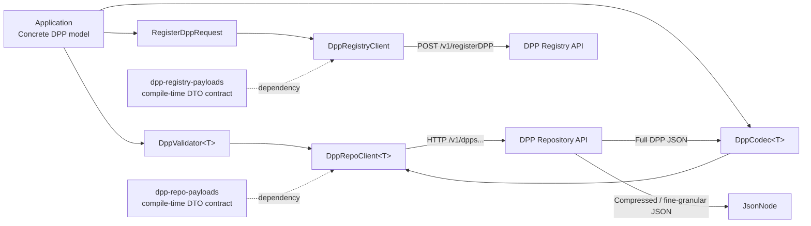

# DPP SDK Clients

## Purpose and model independence

`dpp-sdk-clients` provides generic Java HTTP clients and transport DTOs for DPP repository and registry APIs. It is model-independent: the repository client never depends on a concrete DPP model. A consumer supplies its own `DppCodec<T>` for full-DPP JSON conversion and a `DppValidator<T>` for validation before creates.

The clients implement the routes and contracts documented here. Some `/v1`
API contracts were designed with reference to confidential external technical
specifications that are outside the scope of this public repository.



The repository client remains model-independent by receiving validation and
full-DPP JSON conversion as application-supplied adapters. Typed operations
return `T`, while compressed and fine-granular operations return neutral
`JsonNode` values. Registry registration uses metadata DTOs and does not
transfer the complete DPP.

The payload modules define the request, response, and wrapper DTO contract
used at each HTTP boundary. They keep the JSON field names and response shape
stable between the generic clients and the repository or registry services;
they do not contain concrete DPP models, persistence, or service logic.

## Module and artifact selection

| Need | Artifact |
| --- | --- |
| Repository response/request DTOs only | `dpp.client:dpp-repo-payloads:0.5.0` |
| Generic repository lifecycle and fine-granular HTTP client | `dpp.client:dpp-repo-client:0.5.0` |
| Registry registration DTOs only | `dpp.client:dpp-registry-payloads:0.5.0` |
| Registry registration HTTP client | `dpp.client:dpp-registry-client:0.5.0` |

The parent is `dpp.client:dpp-sdk-clients:0.5.0` with `pom` packaging. Client artifacts depend on their matching payload artifact; they do not provide a concrete DPP model, codec, or validator.

## Maven dependencies

Most applications use one or both client artifacts. Their matching payload
artifacts are included transitively and do not normally need to be declared
separately.

```xml
<dependency>
    <groupId>dpp.client</groupId>
    <artifactId>dpp-repo-client</artifactId>
    <version>0.5.0</version>
</dependency>

<dependency>
    <groupId>dpp.client</groupId>
    <artifactId>dpp-registry-client</artifactId>
    <version>0.5.0</version>
</dependency>
```

Use the payload artifacts directly only when an integration needs DTOs without the HTTP clients.

## Using payload artifacts without the clients

Use the payload artifacts independently when an integration needs the
repository or registry request/response DTOs but supplies its own HTTP
framework. This illustrative fragment shows the repository batch-lookup
contract; the consuming application owns routing, lookup, storage, and HTTP
response handling.

```java
import com.fasterxml.jackson.databind.ObjectMapper;
import dpp.repo.payloads.ReadDppIdsRequest;
import dpp.repo.payloads.ReadDppIdsResponse;

ObjectMapper mapper = new ObjectMapper();
ReadDppIdsRequest request = mapper.readValue(requestJson, ReadDppIdsRequest.class);
ReadDppIdsResponse response = lookupDppIds(request);
String responseJson = mapper.writeValueAsString(response);
```

The demo uses the same payload contracts in its repository and mock-registry
controllers, with `DppApiResponse` as the shared response envelope. See the
[demo README](../dpp-sdk-demo/README.md) for the actual service implementation.
Use `dpp-repo-client` or `dpp-registry-client` when the provided HTTP clients
are required.

## Supply `DppCodec<T>` and `DppValidator<T>`

The codec handles only full-DPP representation JSON. The validator is invoked by `createDpp` before any request is sent; it is deliberately not invoked for partial or fine-granular updates. Client-side validation cannot validate an incomplete DPP fragment. The target repository remains responsible for applying the update and validating the resulting complete DPP according to its implementation.

```java
import dpp.repo.client.core.DppCodec;
import dpp.repo.client.core.DppValidator;
import dppsdk.dpp4fun.model.Dpp4Fun;
import dppsdk.dpp4fun.transport.Dpp4FunJsonCodec;
import dppsdk.dpp4fun.validation.Dpp4FunValidationService;

Dpp4FunJsonCodec sdkCodec = new Dpp4FunJsonCodec();
Dpp4FunValidationService sdkValidation = new Dpp4FunValidationService();

DppCodec<Dpp4Fun> codec = new DppCodec<>() {
    @Override
    public String toJson(Dpp4Fun dpp) {
        return sdkCodec.toJson(dpp);
    }

    @Override
    public Dpp4Fun fromJson(String json) {
        return sdkCodec.fromJson(json);
    }
};

// The client invokes this before createDpp.
DppValidator<Dpp4Fun> validator = sdkValidation::validate;
```

## Repository client setup

```java
import dpp.repo.client.DppRepoClient;
import dpp.repo.client.HttpDppRepoClient;
import dppsdk.dpp4fun.model.Dpp4Fun;

// The client is generic; the supplied adapters define Dpp4Fun conversion.
DppRepoClient<Dpp4Fun> repoClient = new HttpDppRepoClient<>(
        "http://localhost:8080", codec, validator
);
```

The public constructors are `HttpDppRepoClient(String, DppCodec<T>, DppValidator<T>)` and `HttpDppRepoClient(String, DppCodec<T>, DppValidator<T>, ObjectMapper)`. The base URL is normalized by removing trailing slashes. Use the `ObjectMapper` overload only when the application requires custom JSON configuration; otherwise, use the simpler constructor.

## Registry client setup

```java
import dpp.registry.client.DppRegistryClient;
import dpp.registry.client.HttpDppRegistryClient;

// Registry registration uses metadata DTOs and needs no DPP codec or validator.
DppRegistryClient registryClient = new HttpDppRegistryClient("http://localhost:8081");
```

`HttpDppRegistryClient` also has a public `HttpDppRegistryClient(String, ObjectMapper)` constructor.

## Repository client API

`DppRepoClient<T>` has the following public methods:

```java
CreateDppResponse createDpp(T dpp);
T readDppById(String dppId);
JsonNode readCompressedDppById(String dppId);
T readDppByProductId(String productId);
T readDppVersionByIdAndDate(String dppId, Instant date);
@Deprecated T readDppVersionByProductIdAndDate(String productId, Instant date);
ReadDppIdsResponse readDppIdsByProductIds(List<String> productIds, Integer limit, String cursor);
T updateDppById(String dppId, JsonNode partialDpp);
DeleteDppResponse deleteDppById(String dppId);
JsonNode readDataElement(String dppId, String elementIdPath);
JsonNode updateDataElement(String dppId, String elementIdPath, JsonNode dataElement);
```

The deprecated product-ID historical read uses the legacy unversioned route and is retained only for transitional compatibility. New code should use the DPP-ID historical read.

```java
import com.fasterxml.jackson.databind.ObjectMapper;
import com.fasterxml.jackson.databind.node.ObjectNode;
import dpp.repo.payloads.CreateDppResponse;
import dpp.repo.payloads.DeleteDppResponse;

CreateDppResponse created = repoClient.createDpp(dpp);
Dpp4Fun stored = repoClient.readDppById(created.getDppId());

// The partial JSON body updates the supplied nested field.
ObjectNode patch = new ObjectMapper().createObjectNode()
        .putObject("characteristics")
        .put("productName", "Updated via client");

Dpp4Fun updated = repoClient.updateDppById(stored.getDppId(), patch);
DeleteDppResponse deleted = repoClient.deleteDppById(updated.getDppId());
```

The repository applies this as RFC 7396-style JSON Merge Patch: the patch root
must be an object, `null` removes a property, nested objects merge recursively,
and arrays or other non-object values replace the existing value. The HTTP
media type is currently `application/json`, not
`application/merge-patch+json`.

## Full and compressed reads

`readDppById`, `readDppByProductId`, and `readDppVersionByIdAndDate` explicitly request `representation=full` and decode the wrapper payload through `DppCodec<T>`. `readCompressedDppById` explicitly requests `representation=compressed` and returns the wrapper payload as neutral `JsonNode`; it never decodes a compressed representation as `T`.

```java
import com.fasterxml.jackson.databind.JsonNode;
import java.time.Instant;

Dpp4Fun byProductId = repoClient.readDppByProductId(dpp.getProductId());
Dpp4Fun historical = repoClient.readDppVersionByIdAndDate(
        dpp.getDppId(), Instant.parse("2026-06-29T12:00:00Z")
);
JsonNode compressed = repoClient.readCompressedDppById(dpp.getDppId());
```

## Fine-granular operations

Fine-granular reads and updates use direct JSON values: `updateDataElement` sends the supplied `JsonNode` itself, not a wrapper. The client percent-encodes the DPP ID and element path.

```java
import com.fasterxml.jackson.databind.JsonNode;
import com.fasterxml.jackson.databind.node.JsonNodeFactory;

JsonNode productName = repoClient.readDataElement(
        dpp.getDppId(), "$.characteristics.productName"
);
JsonNode changed = repoClient.updateDataElement(
        dpp.getDppId(),
        "$.characteristics.productName",
        JsonNodeFactory.instance.textNode("Updated element value")
);
```

The connected mock repository supports this bounded RFC 9535-compatible absolute singular subset:

- root: `$`
- dot member selectors, for example `$.characteristics.productName`
- quoted bracket member selectors, for example `$['billOfMaterials']`
- non-negative array indexes, for example `$.billOfMaterials.materials[0]`

It does not implement wildcards, descendants, unions, slices, filters, functions, or negative indexes. The mock endpoint returns HTTP 400 for malformed paths, HTTP 404 when a supported path selects no node, and HTTP 501 for a valid JSONPath feature outside that subset. Replacing the root is also a 400. The client maps any non-2xx status to `DppHttpClientException`; it does not pre-evaluate paths.

## Registry registration

The only public registry-client method is `RegisterDppResponse postNewDppToRegistry(RegisterDppRequest request)`. It calls `POST /v1/registerDPP`.

```java
import dpp.registry.payloads.RegisterDppRequest;
import dpp.registry.payloads.RegisterDppResponse;

RegisterDppResponse registered = registryClient.postNewDppToRegistry(
        new RegisterDppRequest(
                dpp.getProductId(),
                dpp.getDppId(),
                "operator-123",
                "http://localhost:8080"
        )
);
String registrationId = registered.getRegistrationId();
```

Outbound request JSON uses `uniqueProductIdentifier`, `digitalProductPassportId`, `uniqueEconomicOperatorIdentifier`, and `dppApiEndpoint`. The response field is `registrationId`. The DTOs accept legacy aliases (`productIdentifier`, `dppIdentifier`, `operatorIdentifier`, `repoUrl`, and `registryIdentifier`) during deserialization/source transition, but those names are not emitted as current JSON fields. No backup-operator field is implemented.

## Exception handling

Repository and registry clients have separate exception packages, even where
the simple class names are identical. Catch the `DppClientException` base class
from the client family being called, or catch a specific subtype:

- `DppHttpClientException` for non-2xx responses (exposes HTTP status and response body)
- `DppApiClientException` for a 2xx response whose API-wrapper status is an error (exposes status, messages, and raw body)
- `DppMappingClientException` for JSON/codec mapping failures or missing required response fields
- `DppNetworkClientException` for I/O or interrupted HTTP requests
- repository only: `DppValidationClientException` when `createDpp` validation fails before the request

```java
try {
    repoClient.createDpp(dpp);
} catch (dpp.repo.client.exception.DppClientException exception) {
    System.err.println(exception.getMessage());
}
```

## Endpoint coverage

| Public client method family | Route |
| --- | --- |
| Create, full/compressed read, update, delete | `/v1/dpps` and `/v1/dpps/{dppId}` |
| Full read by product ID | `/v1/dppsByProductId/{productId}` |
| Full historical read | `/v1/dppsByIdAndDate/{dppId}?date={instant}` |
| Batch ID lookup | `POST /v1/dppsByProductIds` |
| Fine-granular read/update | `/v1/dpps/{dppId}/elements/{elementIdPath}` |
| Registry registration | `POST /v1/registerDPP` |

The mock repository and registry expose internal/demo endpoints for health checks, events, and registry lookup. They are not public `dpp-sdk-clients` methods and are intentionally not documented as client operations here.

## Boundaries

- Client modules own generic HTTP, wrapper parsing, DTOs, and exception mapping—not concrete models, codecs, validators, persistence, or mock runtime behavior.
- The repository stores full DPPs; registry registration is metadata-only.
- No auth, retries, asynchronous API, cache, or production-operational guarantee is provided.
- This README does not claim full RFC 9535 support or formal specification compliance.

## Specification status

The behavior supported by this implementation is documented directly in this
README. Compressed representations remain project-defined, and fine-granular
operations support only the documented singular JSONPath subset.

No formal specification compliance is claimed.

## Contributor build commands

Requires JDK 17. The Maven wrapper is at the repository root. The commands below keep the working directory at the repository root and select the clients reactor with `-f`.

Required working directory: repository root.

Run the tests:

```powershell
.\mvnw.cmd -f .\dpp-sdk-clients\pom.xml test
```

```bash
./mvnw -f ./dpp-sdk-clients/pom.xml test
```

Build, test, and install all client artifacts locally:

```powershell
.\mvnw.cmd -f .\dpp-sdk-clients\pom.xml clean install
```

```bash
./mvnw -f ./dpp-sdk-clients/pom.xml clean install
```

### Build the payload modules

The payload modules are ordinary Maven modules. A full client build compiles
them transitively, or they can be tested independently from the repository
root:

Test `dpp-repo-payloads`:

```powershell
.\mvnw.cmd -f .\dpp-sdk-clients\pom.xml -pl dpp-repo-payloads -am test
```

```bash
./mvnw -f ./dpp-sdk-clients/pom.xml -pl dpp-repo-payloads -am test
```

Test `dpp-registry-payloads`:

```powershell
.\mvnw.cmd -f .\dpp-sdk-clients\pom.xml -pl dpp-registry-payloads -am test
```

```bash
./mvnw -f ./dpp-sdk-clients/pom.xml -pl dpp-registry-payloads -am test
```

Use `clean install` on the clients parent when another local Maven project
needs the payload JARs. The payload usage examples are in the earlier
“Using payload artifacts without the clients” section; this contributor section contains the build
commands only.

### Focused module tests

Run any of these focused reactors from the repository root:

```powershell
.\mvnw.cmd -f .\dpp-sdk-clients\pom.xml -pl dpp-repo-client -am test
```

```bash
./mvnw -f ./dpp-sdk-clients/pom.xml -pl dpp-repo-client -am test
```

```powershell
.\mvnw.cmd -f .\dpp-sdk-clients\pom.xml -pl dpp-registry-client -am test
```

```bash
./mvnw -f ./dpp-sdk-clients/pom.xml -pl dpp-registry-client -am test
```

## Related documentation

- [DPP datamodel](../dpp-datamodel/README.md) — concrete `Dpp4Fun` model, codec, and validation
- [DPP demo](../dpp-sdk-demo/README.md) — runnable repository and registry services
- [Root README](../README.md) — Docker quick start and repository overview
