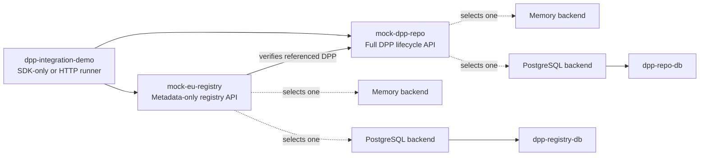

# DPP SDK Demo

## Purpose

`dpp-sdk-demo` is the runnable demonstration area for the SDK. It contains a mock DPP repository, a mock registry, and a command-line walkthrough. It is demo code, not a reusable library or a production deployment.

| Module | Role | Default local address |
| --- | --- | --- |
| `mock-dpp-repo` | Stores complete DPPs; demonstrates lifecycle, version, fine-granular, and health endpoints | `http://localhost:8080` |
| `mock-eu-registry` | Stores registration metadata and verifies the referenced repository DPP | `http://localhost:8081` |
| `dpp-integration-demo` | Runs SDK-only and HTTP walkthroughs | none |

This guide owns setup and operations. [`DEMO_GUIDE.md`](DEMO_GUIDE.md) is the presenter script.

## Architecture at a glance



The repository mock owns full DPP lifecycle, version, and fine-granular
operations. The registry mock stores registration metadata and verifies the
referenced repository DPP; it never stores the complete DPP document. The
integration runner can exercise the SDK directly or call the two HTTP APIs.
Memory and PostgreSQL are selectable backends for each mock. Docker starts
the two PostgreSQL databases; local memory mode does not require databases.

## Choose an execution mode

| Mode | Use it when | Storage |
| --- | --- | --- |
| Docker quick run | You want the complete stack with the least local process management | PostgreSQL for both mocks |
| Local JARs, memory | You want a fast, disposable local walkthrough | In memory; lost on stop |
| Local JARs with PostgreSQL | You want durable mock data while debugging locally | PostgreSQL |
| Mixed | You want local APIs against Docker-managed PostgreSQL | PostgreSQL |
| SDK-only runner | You only want builders, validation, mapping, and codec output | No services |
| HTTP runner | You want the client-to-mock-service flow | Either running service mode |

All commands below run from the **repository root**. The demo module also
contains Maven wrappers, but the documented commands use the root wrapper so
the working directory never changes.

## Prerequisites

- Java 17
- Docker Desktop or Docker Engine with Compose, for Docker or PostgreSQL modes
- The upstream artifacts in the local Maven repository when building this subproject alone

For an isolated demo build, install the upstream reactors in the following
order from the repository root — PowerShell:

```powershell
.\mvnw.cmd -f .\dpp-datamodel\pom.xml clean install
.\mvnw.cmd -f .\dpp-postgres\pom.xml clean install
.\mvnw.cmd -f .\dpp-sdk-clients\pom.xml clean install
```

Linux/macOS Bash:

```bash
./mvnw -f ./dpp-datamodel/pom.xml clean install
./mvnw -f ./dpp-postgres/pom.xml clean install
./mvnw -f ./dpp-sdk-clients/pom.xml clean install
```

An existing `.env` can override backend and port defaults. The documented
memory-mode commands pass explicit backend properties so the result remains
reproducible.

Then build the runnable JARs — PowerShell:

```powershell
.\mvnw.cmd -f .\dpp-sdk-demo\pom.xml clean package
```

Linux/macOS Bash:

```bash
./mvnw -f ./dpp-sdk-demo/pom.xml clean package
```

The generated runnable artifacts are `dpp-sdk-demo/mock-dpp-repo/target/mock-dpp-repo-0.5.0-exec.jar`, `dpp-sdk-demo/mock-eu-registry/target/mock-eu-registry-0.5.0-exec.jar`, and `dpp-sdk-demo/dpp-integration-demo/target/dpp-integration-demo-0.5.0.jar`.

## Docker quick run

Use this for the complete PostgreSQL-backed stack. `dpp-sdk-demo/docker-compose.yml` builds the two API images from the JARs above and starts PostgreSQL 16 containers first.

**Working directory:** repository root.

PowerShell:

```powershell
docker compose -f .\dpp-sdk-demo\docker-compose.yml up -d --build
docker compose -f .\dpp-sdk-demo\docker-compose.yml ps
Invoke-WebRequest http://localhost:8080/health | Select-Object -ExpandProperty Content
Invoke-WebRequest http://localhost:8081/health | Select-Object -ExpandProperty Content
```

Linux/macOS Bash:

```bash
docker compose -f ./dpp-sdk-demo/docker-compose.yml up -d --build
docker compose -f ./dpp-sdk-demo/docker-compose.yml ps
curl --fail http://localhost:8080/health
curl --fail http://localhost:8081/health
```

Wait until both API containers are healthy or running before executing the
health requests. If a request initially fails, inspect:

PowerShell:

```powershell
docker compose -f .\dpp-sdk-demo\docker-compose.yml ps
docker compose -f .\dpp-sdk-demo\docker-compose.yml logs --tail=100 dpp-repo-api
docker compose -f .\dpp-sdk-demo\docker-compose.yml logs --tail=100 dpp-registry-api
```

Linux/macOS Bash:

```bash
docker compose -f ./dpp-sdk-demo/docker-compose.yml ps
docker compose -f ./dpp-sdk-demo/docker-compose.yml logs --tail=100 dpp-repo-api
docker compose -f ./dpp-sdk-demo/docker-compose.yml logs --tail=100 dpp-registry-api
```

Success: both APIs are `running` in the default Compose stack, and each health request returns JSON with `status` `UP`. Use [Stop and clean](#stop-and-clean) for shutdown choices.

Opening `http://localhost:8080/` or `http://localhost:8081/` redirects directly to the corresponding Swagger UI. Use `/health` for machine-readable status and `/v3/api-docs` for OpenAPI JSON.

### Compose files

| Compose file | Purpose |
| --- | --- |
| `docker-compose.yml` | Default buildable full stack with repository API, registry API, and both PostgreSQL databases |
| `docker-compose.build.yml` | Alternate filename for the same buildable full-stack definition; it currently matches `docker-compose.yml` |
| `docker-compose.postgres.yml` | Configured-image full stack; individual database services can also be selected for mixed local-JAR mode |

## Local JAR quick run with memory

Use this for disposable local development. Memory is the code default only when neither backend property is supplied; an existing `.env` is loaded by both services, so explicitly select memory for a reproducible run.

**Working directory:** repository root; run the repository and registry commands in separate terminals.

Start the repository in one terminal:

PowerShell:

```powershell
java -jar .\dpp-sdk-demo\mock-dpp-repo\target\mock-dpp-repo-0.5.0-exec.jar --dpp.repo.backend=memory --server.port=8080 --debug=false
```

Linux/macOS Bash:

```bash
java -jar ./dpp-sdk-demo/mock-dpp-repo/target/mock-dpp-repo-0.5.0-exec.jar --dpp.repo.backend=memory --server.port=8080 --debug=false
```

Then start the registry in another terminal:

PowerShell:

```powershell
java -jar .\dpp-sdk-demo\mock-eu-registry\target\mock-eu-registry-0.5.0-exec.jar --dpp.registry.backend=memory --server.port=8081 --demo.repo.public-base-url=http://localhost:8080 --demo.repo.verification-base-url=http://localhost:8080 --debug=false
```

Linux/macOS Bash:

```bash
java -jar ./dpp-sdk-demo/mock-eu-registry/target/mock-eu-registry-0.5.0-exec.jar --dpp.registry.backend=memory --server.port=8081 --demo.repo.public-base-url=http://localhost:8080 --demo.repo.verification-base-url=http://localhost:8080 --debug=false
```

Success: `GET /health` at both addresses returns `UP`. Stop each service with `Ctrl+C` in its terminal.

## PostgreSQL and mixed modes

`dpp.repo.backend=postgres` makes the repository use `Dpp4FunPostgresRepository`; `dpp.registry.backend=postgres` enables the registry's demo-local PostgreSQL backend. Both require `spring.datasource.url`, `spring.datasource.username`, and `spring.datasource.password` (or the corresponding `SPRING_DATASOURCE_*` environment variables).

Use this local-JAR PostgreSQL mode when the APIs should run on the host but the databases should be durable. It is also the supported mixed local/Docker mode: start only the databases from `dpp-sdk-demo/docker-compose.postgres.yml`, then run the local JARs against their host ports (5433 and 5434 by default).

**Working directory:** repository root.

### 1. Start the PostgreSQL databases

PowerShell:

```powershell
docker compose -f .\dpp-sdk-demo\docker-compose.postgres.yml up -d dpp-repo-db dpp-registry-db
```

Linux/macOS Bash:

```bash
docker compose -f ./dpp-sdk-demo/docker-compose.postgres.yml up -d dpp-repo-db dpp-registry-db
```

### 2. Start the repository in a separate terminal

PowerShell:

```powershell
java -jar .\dpp-sdk-demo\mock-dpp-repo\target\mock-dpp-repo-0.5.0-exec.jar --dpp.repo.backend=postgres --spring.datasource.url=jdbc:postgresql://localhost:5433/dpp_repo --spring.datasource.username=dpp_repo --spring.datasource.password=dpp_repo --server.port=8080 --debug=false
```

Linux/macOS Bash:

```bash
java -jar ./dpp-sdk-demo/mock-dpp-repo/target/mock-dpp-repo-0.5.0-exec.jar --dpp.repo.backend=postgres --spring.datasource.url=jdbc:postgresql://localhost:5433/dpp_repo --spring.datasource.username=dpp_repo --spring.datasource.password=dpp_repo --server.port=8080 --debug=false
```

### 3. Start the registry in another terminal

PowerShell:

```powershell
java -jar .\dpp-sdk-demo\mock-eu-registry\target\mock-eu-registry-0.5.0-exec.jar --dpp.registry.backend=postgres --spring.datasource.url=jdbc:postgresql://localhost:5434/dpp_registry --spring.datasource.username=dpp_registry --spring.datasource.password=dpp_registry --server.port=8081 --demo.repo.public-base-url=http://localhost:8080 --demo.repo.verification-base-url=http://localhost:8080 --debug=false
```

Linux/macOS Bash:

```bash
java -jar ./dpp-sdk-demo/mock-eu-registry/target/mock-eu-registry-0.5.0-exec.jar --dpp.registry.backend=postgres --spring.datasource.url=jdbc:postgresql://localhost:5434/dpp_registry --spring.datasource.username=dpp_registry --spring.datasource.password=dpp_registry --server.port=8081 --demo.repo.public-base-url=http://localhost:8080 --demo.repo.verification-base-url=http://localhost:8080 --debug=false
```

Success: both local health URLs return `UP`. Created database records remain
available across JAR restarts while the PostgreSQL containers and volumes are
retained. Stop the JARs with `Ctrl+C`, then use the PostgreSQL cleanup commands
in [Stop and clean](#stop-and-clean).

For a full prebuilt-image PostgreSQL stack, start the configured-image Compose stack after publishing or pulling the configured images. The default `dpp-sdk-demo/docker-compose.yml` and `dpp-sdk-demo/docker-compose.build.yml` are the buildable full-stack definitions.

## Individual service control

Use this while debugging one service. Docker starts required dependencies automatically.

**Working directory:** repository root.

PowerShell:

```powershell
docker compose -f .\dpp-sdk-demo\docker-compose.yml up -d dpp-repo-api
docker compose -f .\dpp-sdk-demo\docker-compose.yml logs -f dpp-repo-api
docker compose -f .\dpp-sdk-demo\docker-compose.yml stop dpp-repo-api
```

Linux/macOS Bash:

```bash
docker compose -f ./dpp-sdk-demo/docker-compose.yml up -d dpp-repo-api
docker compose -f ./dpp-sdk-demo/docker-compose.yml logs -f dpp-repo-api
docker compose -f ./dpp-sdk-demo/docker-compose.yml stop dpp-repo-api
```

The `logs -f` command follows the logs until you press `Ctrl+C`; it does not
stop the service. Run the subsequent `stop` command afterward when needed.

The registry expects a reachable repository for new registration verification. In Docker, its internal verifier uses `http://dpp-repo-api:8080`; the registration's public `dppApiEndpoint` can remain a host-reachable URL such as `http://localhost:8080`.

Success: the selected service's Compose logs show it started and its `/health` endpoint returns `UP`. The last command above stops the selected service; start that service again with the matching platform-specific Compose command.

## Integration-demo modes

Run these after building:

- `sdk` runs the SDK-only walkthrough and needs no services.
- `http` runs the HTTP walkthrough and is the explicit HTTP mode.
- `standards` is the default mode and an alias for the HTTP walkthrough.
- `all` and `sdk-http` run the SDK walkthrough followed by the HTTP flow.

HTTP modes first probe `/health` and then use the repository and registry.
Optional positional URLs are `registryUrl` then `repoUrl`.

**Working directory:** repository root.

PowerShell:

```powershell
java -jar .\dpp-sdk-demo\dpp-integration-demo\target\dpp-integration-demo-0.5.0.jar sdk --debug=false
java -jar .\dpp-sdk-demo\dpp-integration-demo\target\dpp-integration-demo-0.5.0.jar http --debug=false
java -jar .\dpp-sdk-demo\dpp-integration-demo\target\dpp-integration-demo-0.5.0.jar all --debug=false
java -jar .\dpp-sdk-demo\dpp-integration-demo\target\dpp-integration-demo-0.5.0.jar http http://localhost:8081 http://localhost:8080 --debug=false
```

Linux/macOS Bash:

```bash
java -jar ./dpp-sdk-demo/dpp-integration-demo/target/dpp-integration-demo-0.5.0.jar sdk --debug=false
java -jar ./dpp-sdk-demo/dpp-integration-demo/target/dpp-integration-demo-0.5.0.jar http --debug=false
java -jar ./dpp-sdk-demo/dpp-integration-demo/target/dpp-integration-demo-0.5.0.jar all --debug=false
java -jar ./dpp-sdk-demo/dpp-integration-demo/target/dpp-integration-demo-0.5.0.jar http http://localhost:8081 http://localhost:8080 --debug=false
```

Success for `sdk`: `SDK capability demo complete`. Success for HTTP modes: `HTTP services demo complete`; it creates, reads, updates, registers, exercises expected failures, and soft-deletes a DPP. The runner exits itself when complete.

## Stop and clean

Run these from the **repository root** after any Docker-based mode. Stop local JAR processes with `Ctrl+C` in the terminal that started each process.

PowerShell:

```powershell
docker compose -f .\dpp-sdk-demo\docker-compose.yml stop
```

Linux/macOS Bash:

```bash
docker compose -f ./dpp-sdk-demo/docker-compose.yml stop
```

The command above stops the default stack while retaining its volumes. To
remove the default stack while retaining its volumes, run instead:

PowerShell:

```powershell
docker compose -f .\dpp-sdk-demo\docker-compose.yml down
```

Linux/macOS Bash:

```bash
docker compose -f ./dpp-sdk-demo/docker-compose.yml down
```

To remove the default stack and its persisted PostgreSQL data, run instead:

PowerShell:

```powershell
docker compose -f .\dpp-sdk-demo\docker-compose.yml down -v
```

Linux/macOS Bash:

```bash
docker compose -f ./dpp-sdk-demo/docker-compose.yml down -v
```

For the PostgreSQL-only Compose file, choose one of these alternatives:

Stop its containers while retaining volumes:

PowerShell:

```powershell
docker compose -f .\dpp-sdk-demo\docker-compose.postgres.yml stop
```

Linux/macOS Bash:

```bash
docker compose -f ./dpp-sdk-demo/docker-compose.postgres.yml stop
```

Remove its containers and network while retaining volumes:

PowerShell:

```powershell
docker compose -f .\dpp-sdk-demo\docker-compose.postgres.yml down
```

Linux/macOS Bash:

```bash
docker compose -f ./dpp-sdk-demo/docker-compose.postgres.yml down
```

Remove its containers, network, and database volumes:

PowerShell:

```powershell
docker compose -f .\dpp-sdk-demo\docker-compose.postgres.yml down -v
```

Linux/macOS Bash:

```bash
docker compose -f ./dpp-sdk-demo/docker-compose.postgres.yml down -v
```

`down -v` removes the respective Compose containers, network, and named
PostgreSQL volumes. Success: the matching Compose `ps` command shows no services.

## Common ports and runtime configuration

| Setting | Default | Meaning |
| --- | --- | --- |
| `MOCK_REPO_PORT` / `DPP_REPO_PORT` | 8080 | Repository HTTP port (`MOCK_REPO_PORT` wins) |
| `MOCK_REGISTRY_PORT` / `DPP_REGISTRY_PORT` | 8081 | Registry HTTP port (`MOCK_REGISTRY_PORT` wins) |
| `DPP_REPO_BACKEND` | memory outside Compose | `memory` or `postgres` repository backend |
| `DPP_REGISTRY_BACKEND` | memory outside Compose | `memory` or `postgres` registry backend |
| `MOCK_REPO_POSTGRES_PORT` | 5433 | Host port for repository PostgreSQL |
| `MOCK_REGISTRY_POSTGRES_PORT` | 5434 | Host port for registry PostgreSQL |
| `DEMO_REPO_VERIFICATION_BASE_URL` | public repository URL | Internal base URL used by registry `HEAD /internal/dpps/{dppId}` verification |

See [`.env.example`](.env.example) for the complete set of image, database, port, backend, and registry-verification variables. Copy it to `.env` only when you want persistent local overrides; never commit credentials. Compose forces both backends to PostgreSQL and supplies container-network JDBC URLs. Service names `dpp-repo-api`, `dpp-registry-api`, `dpp-repo-db`, and `dpp-registry-db` resolve only inside the Compose network; host tools use `localhost` and published ports.

## Swagger/OpenAPI

After either API starts, use:

| Service | API base | Health | Swagger UI | OpenAPI JSON |
| --- | --- | --- | --- | --- |
| Repository | `http://localhost:8080` | `http://localhost:8080/health` | `http://localhost:8080/swagger-ui/index.html` | `http://localhost:8080/v3/api-docs` |
| Registry | `http://localhost:8081` | `http://localhost:8081/health` | `http://localhost:8081/swagger-ui/index.html` | `http://localhost:8081/v3/api-docs` |

Opening either API base URL in a browser redirects to its Swagger UI.

## Postman

Import all three JSON collections from [`postman/`](postman/) (`dpp-sdk-demo/postman` from the repository root): `dpp-lifecycle-api.verified-export-shape.postman_collection.json`, `dpp-fine-granular-api.import-safe.postman_collection.json`, and `dpp-registry-api.verified-export-shape.postman_collection.json`. Set their base URL variables to the ports you selected; Postman does not read `.env` automatically.

## Troubleshooting and success checks

- **Port already in use:** change the relevant `MOCK_*_PORT` or `--server.port`, then pass matching URLs to the integration runner.
- **PostgreSQL start fails:** check the default Compose stack's `ps` output and database logs; verify the chosen host ports are free.
- **Local JAR unexpectedly seeks PostgreSQL:** an `.env` may set a backend. Pass `--dpp.repo.backend=memory` and `--dpp.registry.backend=memory` as above.
- **Registry registration fails:** create the DPP in the repository first and make `DEMO_REPO_VERIFICATION_BASE_URL` reach that repository from the registry process. A 404 means the DPP is absent or deleted; a verification connectivity failure is a 502.
- **Integration runner cannot reach services:** it probes `/health`, preferring Docker service names and then `localhost`. Supply the two explicit URLs when running from another network namespace.

The most useful end-to-end check is the HTTP runner's registry-registration step: it creates a DPP, registers it with `dppApiEndpoint`, and the registry independently verifies its active repository record through the internal HEAD endpoint.

## Boundaries

- The mocks do not prove production security, operational readiness, real registry interoperability, or standards certification.
- The registry stores metadata, not complete DPP JSON.
- Internal `/internal/...` endpoints support the demo; public lifecycle operations are under `/v1/...`.
- Fine-granular support is deliberately bounded: `$`, dot/quoted members, and non-negative indexes. Wildcards, descendants, unions, slices, filters, functions, and negative indexes return 501; malformed paths return 400 and no match returns 404.

## Contributor checks

From the repository root, after isolated-build prerequisites when needed.

### Run demo tests

PowerShell:

```powershell
.\mvnw.cmd -f .\dpp-sdk-demo\pom.xml test
```

Linux/macOS Bash:

```bash
./mvnw -f ./dpp-sdk-demo/pom.xml test
```

Focused tests:

PowerShell:

```powershell
.\mvnw.cmd -f .\dpp-sdk-demo\pom.xml -pl mock-dpp-repo -am test
.\mvnw.cmd -f .\dpp-sdk-demo\pom.xml -pl mock-eu-registry -am test
.\mvnw.cmd -f .\dpp-sdk-demo\pom.xml -pl dpp-integration-demo -am test
```

Linux/macOS Bash:

```bash
./mvnw -f ./dpp-sdk-demo/pom.xml -pl mock-dpp-repo -am test
./mvnw -f ./dpp-sdk-demo/pom.xml -pl mock-eu-registry -am test
./mvnw -f ./dpp-sdk-demo/pom.xml -pl dpp-integration-demo -am test
```

## Demo guide

- [`DEMO_GUIDE.md`](DEMO_GUIDE.md) — presenter-focused sequence and expected observations
- [`../dpp-sdk-clients/README.md`](../dpp-sdk-clients/README.md) — client behavior and API boundary
